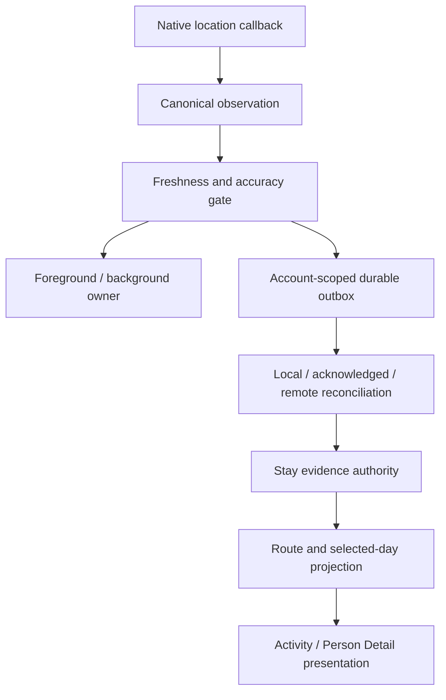

# tipSip engineering showcase

tipSip is a React Native and TypeScript mobile application with private, account-scoped location history and mobility-oriented features. Its location subsystem preserves observations across foreground/background transitions, offline periods, and process recreation.

This repository contains a curated, runnable subset of the private tipSip codebase for technical and academic review: selected production TypeScript modules plus synthetic regression tests. Application UI, infrastructure, and service integrations remain private.

## What the selected code covers

- **Location acceptance:** normalizes provider callbacks once, then checks coordinates, freshness, future skew, and accuracy.
- **Foreground/background handoff:** serializes lifecycle transitions so only one continuous acquisition authority can remain active.
- **Durable delivery:** models an account-partitioned outbox with chronological reads, retry recovery, acknowledgement before retirement, and bounded capacity.
- **Local/remote reconciliation:** treats pending, recently acknowledged, and authorized remote representations as the same observation when their canonical identity matches, even if timestamp serialization or server row IDs differ.
- **Stay reconstruction:** distinguishes durable evidence from presentation, confirms stays conservatively, and rebuilds state after process recreation without inventing GPS points.
- **Mobility projection:** derives movement, stays, temporal gaps, and selected-day events while preserving accuracy and unavailable-data boundaries.
- **Regression testing:** exercises lifecycle ownership, account isolation, persistence semantics, reconciliation, sparse evidence, movement, visit separation, and day projection with synthetic fixtures.

## Selected engineering challenges

### One acquisition authority across lifecycle transitions

**Problem:** asynchronous lifecycle transitions can overlap, allowing a stale completion to revive an obsolete acquisition owner.

**Design decision:** `LocationCaptureOwnershipCoordinator` serializes transitions, stops before starting, and rejects stale completions through generation checks.

### Durable evidence without fabricated location

**Problem:** display and retry timers must not become synthetic observations.

**Design decision:** stay inference consumes only observations that have crossed the durable boundary. Read-time duration may advance, but timer ticks never create GPS evidence or persistent history rows.

### Stable identity through offline reconciliation

**Problem:** local, acknowledgement-shadow, and server records may encode one observation with different row IDs or timestamp spellings.

**Design decision:** reconciliation identifies observations by account, normalized capture instant, and coordinate—not transport-specific identifiers.

### Continuity after process recreation

**Problem:** durable history can reconstruct a visit but cannot prove it remains current in a new process.

**Design decision:** the stay authority rebuilds conservatively. An exact durable callback can prove continuity without adding duplicate evidence.

## Architecture



Acquisition is separate from map rendering; canonical observations are separate from presentation. Timers never generate durable evidence, and current-stay authority remains distinct from historical projection.

The provider-neutral core through selected-day projection is included. Native acquisition, concrete storage, authorized remote reads, maps, and presentation remain behind omitted integration boundaries.

## Technical stack

- **Canonical application:** React Native and TypeScript.
- **Public subset:** selected TypeScript domain modules, type-checked with TypeScript 5.9 and tested with Node's test runner and `tsx`.
- **Design:** interface-driven persistence and read-authority boundaries with immutable, discriminated-union domain models.
- **Mobile tooling:** Expo tooling for development, builds, and native integration workflows.

## Repository structure

| Path | Purpose |
| --- | --- |
| `src/features/locationHistory/` | Location domain, lifecycle, durability, inference, and projection logic |
| `src/lib/` | Observation normalization, sampling, distance, and supporting policies |
| `src/types/` | Focused coordinate type required by the selected modules |
| `shared/planning/` | Included geodesic distance policy used by mobility logic |
| `tests/` | Synthetic invariant and regression tests |
| `docs/` | Architecture, history, privacy, testing, and provenance notes |

## Run the included checks

Requirements: a current Node.js LTS release and npm.

```bash
npm ci
npm run check
```

No environment variables, provider accounts, native SDKs, simulators, databases, or network services are required.

## Testing approach

The public suite runs 11 tests against selected production modules using synthetic accounts, fixed timestamps, and generic coordinates. It covers canonical acceptance, lifecycle ownership, outbox behavior, acknowledgement-before-retirement, timestamp equivalence, account isolation, conservative stay reconstruction, movement and gap separation, and selected-day projection.

The broader private development workflow is failure-first:

1. Express an owner-visible invariant as a deterministic failing test.
2. Locate the earliest broken acquisition, durability, identity, authority, or projection boundary.
3. Apply a bounded repair at that boundary.
4. Rerun the focused case and inherited regression suites.

## Privacy and security boundaries

The selected code keeps raw evidence, derived state, and presentation separate. Account identity is checked at read, durable storage, reconciliation, and stay-authority boundaries. Public fixtures contain synthetic identities, times, and coordinates.

The canonical application repository remains private. The provenance and sanitization process is documented in [Provenance and sanitization](docs/provenance-and-sanitization.md).

## Deliberate scope limits

This repository is an independently testable engineering subset, not the complete mobile application or a deployed service. It does not contain:

- the React Native application shell, UI source, or assets;
- native iOS/Android projects or signing material;
- concrete SQLite, Keychain, or SecureStore integrations;
- private backend or Supabase infrastructure;
- map, geocoding, routing, payment, notification, or AI provider adapters;
- production data, private fixtures, or operational documents.

No omitted integration is replaced with a fictional live service. The included interfaces show the constraints those private boundaries must satisfy.

## Further technical notes

- [Architecture](docs/architecture.md)
- [Location-history model](docs/location-history.md)
- [Testing strategy](docs/testing.md)
- [Privacy and security](docs/privacy-and-security.md)
- [Provenance and sanitization](docs/provenance-and-sanitization.md)
