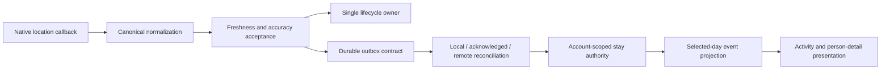

# tipSip engineering showcase

This repository is a focused engineering snapshot of selected systems from **tipSip**, a React Native / Expo application that includes private, account-scoped location history and mobility-aware product experiences.

The showcase is intended for university CS/ECE faculty, undergraduate research supervisors, and technical reviewers. It emphasizes evidence modeling, lifecycle correctness, durable delivery contracts, and failure-first regression testing. It is not a distributable copy of the mobile application and does not connect to any live service.

> The canonical product repository is private. This repository is a sanitized public showcase containing selected implementation and architecture material for technical and academic review.

## Project status

The included TypeScript modules are real implementation selected from an actively developed private application. The selection is independently type-checkable and has a runnable synthetic regression suite. Native UI, credentials, live provider adapters, concrete SQLite bindings, backend services, deployment configuration, and private product data are intentionally omitted.

This repository should not be interpreted as a production release, a deployed service, or the complete tipSip codebase.

## Implemented capabilities represented here

- Strict normalization and acceptance of native location observations
- Serialized foreground/background acquisition ownership
- Account-partitioned durable outbox and acknowledgement-shadow contracts
- Exact local/remote observation reconciliation
- Stable identity across equivalent timestamp serializations
- Sparse-location and measured-motion stay confirmation
- Process-recreation reconstruction without fabricated evidence
- Route segmentation, temporal gaps, and accuracy-aware stay projection
- Fail-closed authority and account-isolation boundaries
- Deterministic regression coverage for lifecycle, persistence, continuity, and real visit separation

## Architecture overview



Only the provider-neutral core through selected-day event projection is included. Native and remote implementations remain behind the interfaces visible in the source.

## Technical stack

- TypeScript 5.9
- React Native / Expo in the canonical private application
- Node's built-in test runner with `tsx` for this isolated showcase
- Interface-driven persistence and read-authority boundaries
- Immutable, discriminated-union domain models

## Selected engineering challenges

### One acquisition authority across lifecycle transitions

`LocationCaptureOwnershipCoordinator` serializes transitions and applies stop-before-start ordering. Generation checks prevent stale asynchronous completions from reviving an obsolete foreground or background owner.

### Durable evidence without fabricated location

Stay inference consumes only observations that have crossed the durable boundary. Read-time duration may advance, but timer ticks never create synthetic GPS evidence or persistent history rows.

### Identity through offline reconciliation

Client, acknowledgement-shadow, and server representations use a provider-neutral identity based on account, normalized capture instant, and coordinate. Server row identifiers and timestamp spelling do not define the logical observation.

### Process-recreation continuity

The stay authority can rebuild from durable history while retaining conservative currentness rules. An exact live callback may prove current-process continuity without incrementing evidence when the same observation was reconstructed first.

See [Architecture](docs/architecture.md), [Location history](docs/location-history.md), [Privacy and security](docs/privacy-and-security.md), and [Testing](docs/testing.md) for more detail.

## Repository structure

```text
shared/planning/                    Geodesic distance dependency used by mobility logic
src/features/locationHistory/       Canonical domain, lifecycle, durability, and projection logic
src/lib/                            Location normalization and supporting policies
src/types/                          Shared product-domain types required by the selected slice
tests/                              Sanitized, synthetic invariant tests
docs/                               Architecture, privacy, testing, and provenance notes
```

## Local setup

Requirements: a current Node.js LTS release and npm.

```bash
npm ci
npm run check
```

No environment variables, provider accounts, native SDKs, simulators, or network services are required by the tests.

## Testing strategy

The public suite exercises production modules using clearly synthetic accounts, timestamps, and coordinates. It covers canonical normalization, lifecycle ownership, acknowledgement-before-retirement behavior, timestamp equivalence, account isolation, ongoing stay continuity, true movement, long evidence gaps, and selected-day projection.

The canonical project uses a broader failure-first regression workflow: an owner-visible invariant is first represented by a deterministic failing test, the earliest broken boundary is identified, and the smallest domain repair is then validated against inherited suites.

## Privacy and security design

The selected code keeps raw evidence, derived state, and presentation separate. Account identity is checked at read, durable storage, reconciliation, and stay-authority boundaries. The showcase contains no live endpoints, API keys, test accounts, residential data, screenshots, service configuration, or Git history.

## Limitations and intentionally omitted components

- No complete React Native application shell or UI assets
- No native iOS/Android projects or signing configuration
- No concrete SQLite/Keychain/SecureStore bindings
- No Supabase schema, migrations, credentials, or service-role code
- No Railway/EAS/deployment configuration
- No live map, geocoding, routing, payment, notification, or AI provider adapters
- No production backend topology or private operational documents
- No real user, device, friend, location, address, or diagnostic data

The interfaces and domain logic are included to show how those omitted boundaries are constrained; the omitted integrations are not replaced with fictional live services.
