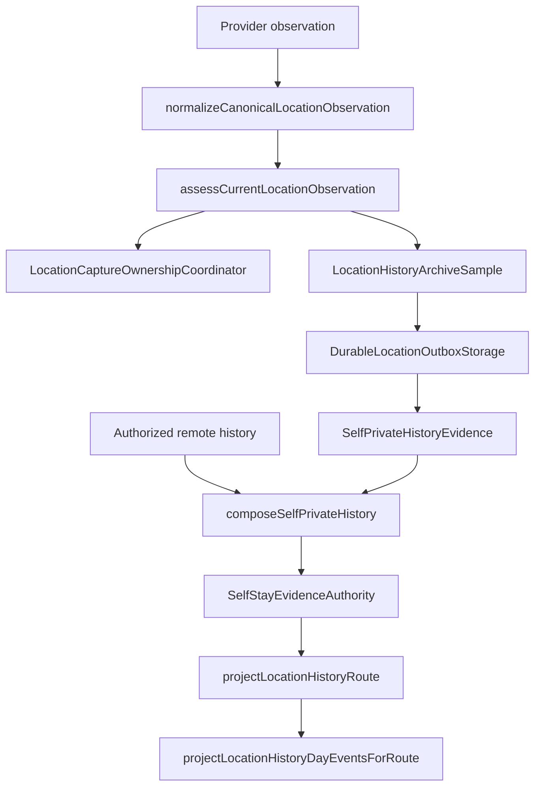

# Architecture

## Scope

This showcase contains a dependency-closed subset of the canonical TypeScript domain. It demonstrates the path from provider observations to private history projections while excluding concrete native, database, and network adapters.

## Canonical evidence

`locationTelemetry.ts` normalizes one provider observation once. Optional telemetry fields fail independently so one malformed sensor value cannot invalidate otherwise usable location evidence. `locationPolicy.ts` then applies coordinate, timestamp, future-skew, age, and accuracy rules.

This evidence is distinct from all later presentation state. A display timer, locale change, remount, or network response cannot create a canonical observation.

## Runtime ownership

`backgroundLocationCapture.ts` defines a single serialized authority for continuous capture. Each reconciliation increments a generation. Stale asynchronous completions stop both adapters instead of assuming they still own the latest state. Foreground/background handoff is stop-before-start, and the snapshot records the maximum simultaneous authority count.

## Durable persistence contract

`durableLocationOutbox.ts` defines the persistence interface, row state machine, retry policy, capacity boundaries, acknowledgement shadow, interruption ledger, and account partition. The included in-memory implementation is the canonical deterministic adapter used by tests. The private application supplies a crash-safe SQLite implementation of the same interface; that platform binding is not included here.

`denseHistoryArchive.ts` owns acceptance into the durable writer and batched delivery through an injected repository. It does not treat an in-memory UI state as durable evidence.

## Reconciliation

`selfPrivateHistory.ts` composes account-matched local evidence and authorized remote history. Exact remote duplicates replace local representations after acknowledgement. The equality key normalizes timestamps to epoch milliseconds and deliberately ignores provider row identifiers.

## Derived mobility state

`SelfStayEvidenceAuthority` consumes durable location points and bounded motion windows. It keeps candidate, confirmed, and finalized semantics separate. Current-process continuity can be proved only by an exact callback that has crossed the durable boundary; history-only reconstruction cannot assert it.

Route and day projection are pure read models. They may extend an ongoing stay to the current read clock, but they never persist timer points or rewrite canonical evidence.

## Omitted boundaries

The private application contains concrete Expo, SQLite, secure-storage, backend, map, and presentation integrations. They are intentionally excluded. No mock network service is presented as equivalent to those implementations.
